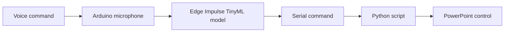
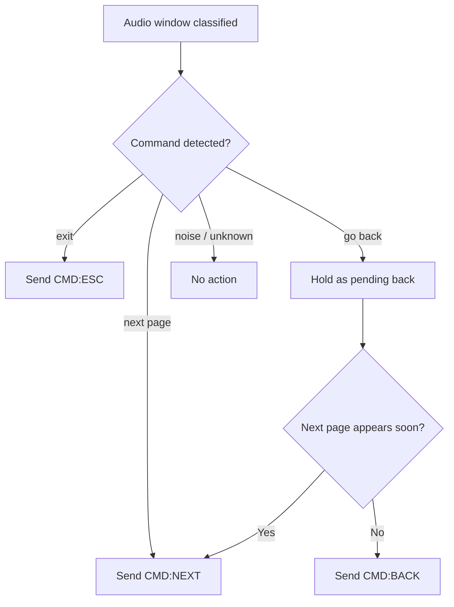

# Offline TinyML Voice Controller for PowerPoint

## Project Overview

This project is a CASA0018 embedded AI prototype that uses an **Arduino Nano 33 BLE Sense Rev2** and **Edge Impulse** to control PowerPoint with voice commands.

The Arduino uses its onboard microphone to listen continuously, runs a TinyML keyword spotting model locally, and sends simple serial commands to a Python script on the computer. The Python script then uses `pyautogui` to control PowerPoint.

The system recognises three commands:

| Voice command | Serial command | PowerPoint action |
|---|---|---|
| `next page` | `CMD:NEXT` | Next slide |
| `go back` | `CMD:BACK` | Previous slide |
| `exit` | `CMD:ESC` | Exit slideshow |

The aim of the project is not to build a full speech assistant, but to explore how a low-cost microcontroller can perform **offline keyword spotting** for hands-free presentation control.

---

## System Diagram



---

## Main Components

- **Arduino Nano 33 BLE Sense Rev2**  
  Captures audio and runs the TinyML model locally.

- **Edge Impulse**  
  Used to collect data, train the keyword spotting model, and export the Arduino library.

- **Python script**  
  Reads serial commands from Arduino and maps them to keyboard actions.

- **PowerPoint**  
  Responds to the simulated keyboard inputs.

---

## Model Design

The model was trained in Edge Impulse using five classes:

- `next page`
- `go back`
- `exit`
- `noise`
- `unknown`

The `noise` and `unknown` classes were included so the model would not treat every sound as a command.

The final model uses:

- Audio input at **16 kHz**
- **MFCC** feature extraction
- A small **1D CNN classifier**
- Quantised **int8 Arduino deployment**
- 1-second audio window
- 250 ms window increase for better live recognition

---

## Development Process

1. Created an Edge Impulse project.
2. Collected labelled audio samples for the three commands, background noise, and unknown speech.
3. Trained a keyword spotting model using MFCC features and a 1D CNN.
4. Tested the model using Edge Impulse validation and test sets.
5. Deployed the model as an Arduino library.
6. Modified the Arduino continuous microphone example to output serial commands.
7. Wrote a Python script to convert serial commands into PowerPoint keyboard controls.
8. Added Arduino-side post-processing to reduce false triggers during continuous listening.

---

## Key Challenge

The main challenge was that live performance was different from offline test accuracy.

The phrase `next page` could be split across adjacent 1-second audio windows. When this happened, part of the phrase was sometimes misclassified as `go back`.

To improve this, I reduced the window increase to **250 ms** and added Arduino-side post-processing. In particular, the system delays `go back` briefly so that a following `next page` prediction can override it if needed.



---

## Results

Two quantised int8 models were tested.

| Metric | Initial model | Final model |
|---|---:|---:|
| Test accuracy | 90.0% | 90.0% |
| AUC | 0.99 | 0.99 |
| Weighted precision | 0.92 | 0.93 |
| Weighted recall | 0.92 | 0.93 |
| Weighted F1 score | 0.92 | 0.93 |

Class-level results for the final model:

| Class | Test accuracy |
|---|---:|
| `exit` | 96.7% |
| `go back` | 100.0% |
| `next page` | 90.0% |
| `noise` | 83.3% |
| `unknown` | 80.0% |

The final system worked successfully in the full pipeline:

```text
voice command → Arduino inference → serial command → Python → PowerPoint
```

---

## Demo Use

1. Upload the Arduino code to the Nano 33 BLE Sense Rev2.
2. Close Arduino Serial Monitor.
3. Run the Python script:

```bash
python ppt_voice_controller.py
```

4. Open PowerPoint in slideshow mode.
5. Say one of the supported commands:
   - `next page`
   - `go back`
   - `exit`

---

## Limitations

- The Python script must be running on the computer.
- The system depends on the PowerPoint window being active.
- Performance is affected by microphone distance, speaking speed, and background noise.
- The model was trained on a limited dataset, so it may not generalise perfectly to all speakers.

---

## Edge Impulse Project

Add Edge Impulse project link here.

## GitHub Repository

Add GitHub repository link here.
